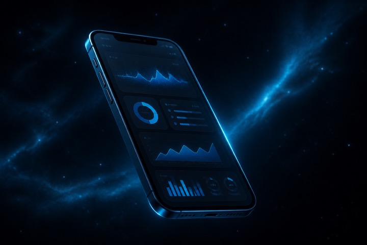
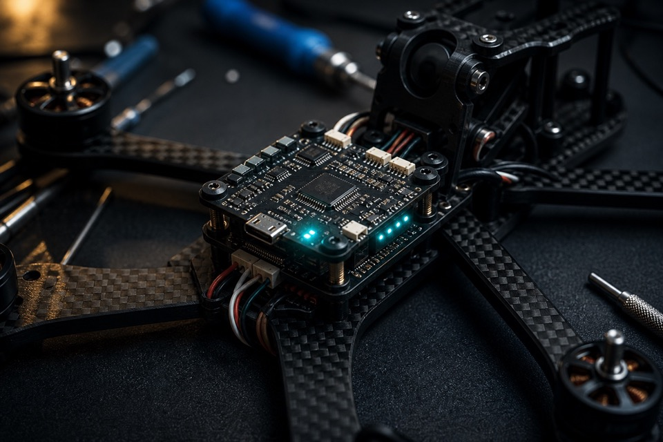

  
  

 

  
  &nbsp;
  
  &nbsp;
  
  &nbsp;
  

<table>
  <tr>
    <td width="33%" align="center" valign="top">
      
        
      <b>iOS</b> 
      Swift · SwiftUI · Firebase · WidgetKit
    </td>
    <td width="33%" align="center" valign="top">
      
        
      <b>Flight</b> 
      Pixhawk · APM · SpeedyBee · QGC
    </td>
    <td width="33%" align="center" valign="top">
      
        
      <b>Intelligence</b> 
      YOLO · PyTorch · OpenCV · U-Net
    </td>
  </tr>
</table>

I work where software meets machines that move. Native <b>iOS</b> at <b>WTW</b>. Custom airframes I assemble and tune. Deep-learning models that actually ship. 
<i>B.E. Computer Science, Jadavpur University · previously JUSense Technology &amp; NESAC.</i>

 

<table>
  <tr>
    <td width="50%" valign="top">
      
        
      <b>ORBITALIS</b> · Next.js · Three.js · Mac 
      A live 3D Earth. Track satellites in LEO / MEO / GEO, scrub time, read telemetry on a globe — not a spreadsheet.
    </td>
    <td width="50%" valign="top">
      
        
      <b>MacPulse</b> · Swift · WidgetKit 
      CPU, memory, thermals, battery, network, processes — a health score that never leaves the machine.
    </td>
  </tr>
  <tr>
    <td width="50%" valign="top">
      
        
      <b>SAAMU-Net</b> · PyTorch · IEEE 2025 
      Selective attention + memory-augmented U-Net for microscopic nuclei. Published in IEEE Xplore.
    </td>
    <td width="50%" valign="top">
      
        
      <b>Drone works</b> · Pixhawk · YOLO 
      Airframes I build and fly, plus detection / classification / segmentation after the landing.
    </td>
  </tr>
</table>

  
  
  
  

### The stack I actually use

 

  
  
   
  
   
  

**Let’s build the next one.**

iOS · drones · vision — or something that doesn’t have a category yet.

 

  

`signal locked · kolkata · utc+5:30`

