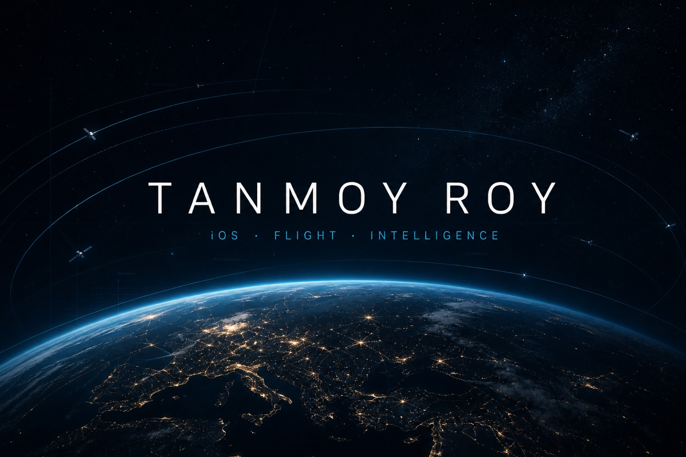

<div align="center">
  
</div>

<br />

<div align="center">

[](https://github.com/Tanmoy07072001)

**iOS Developer at [WTW](https://www.wtwco.com)** · B.E. CSE, [Jadavpur University](https://www.jaduniv.edu.in) · Kolkata

[](https://imaginative-stardust-36f7d1.netlify.app/)
[](https://www.linkedin.com/in/tanmoy-roy-ba8325287)
[](https://doi.org/10.1109/scm66446.2025.11060238)
[](https://github.com/Tanmoy07072001)


</div>

---

## Built for flight, silicon, and signal

I work where software meets machines that move — native **iOS** with Swift and SwiftUI, airframes I assemble and tune myself, and **deep-learning** models that actually ship.

By day I am an **iOS Developer at WTW (Willis Towers Watson)**. Before that, at **JUSense Technology** I flew custom multi-rotors, shipped Firebase-backed iOS apps, and deployed detection models through Streamlit. I also trained at **NESAC** (North Eastern Space Applications Centre).

The through-line is the same: take a hard system, and make it feel inevitable.

```swift
struct TanmoyRoy {
    let role      = "iOS Developer @ WTW"
    let education = "B.E. Computer Science, Jadavpur University (2021–2025)"
    let crafts    = ["Swift", "SwiftUI", "YOLO", "PyTorch", "Pixhawk"]
    let building  = "Things you can hold, fly, and watch think"
}
```

<br />

## Now

-  Shipping native iOS at **WTW** — June 2025 → present
- 🌍 Building **[ORBITALIS](https://imaginative-stardust-36f7d1.netlify.app/)** — a live 3D Earth that tracks satellites in orbit
- 🧠 Computer vision in production tools — **YOLOv7 / v8 / NAS**, Faster R-CNN, Mask R-CNN
- 🛸 Custom airframes on **Pixhawk, APM, SpeedyBee** — plus post-flight detection pipelines

<br />

## Selected work

<table>
<tr>
<td width="50%" valign="top">

### ORBITALIS
**Live 3D digital Earth** · Next.js · Three.js · native Mac

Track thousands of satellites, filter LEO / MEO / GEO, scrub time, and read telemetry on a globe — not a spreadsheet.

[See the work ↗](https://imaginative-stardust-36f7d1.netlify.app/)

</td>
<td width="50%" valign="top">

### MacPulse
**On-device Mac monitor** · Swift · WidgetKit

Live CPU, memory, thermals, battery, network, processes, ports, and a health score. Telemetry never leaves the machine.

[See the work ↗](https://imaginative-stardust-36f7d1.netlify.app/)

</td>
</tr>
<tr>
<td width="50%" valign="top">

### [LinkLoop](https://github.com/Tanmoy07072001/Twitter)
**Twitter-class social app** · Swift · Firebase · Firestore

Auth, tweets, profiles, notifications, and messaging — Kingfisher for images, a full social loop on iOS.

</td>
<td width="50%" valign="top">

### [Whisper](https://github.com/Tanmoy07072001/chatapp2-name-whisper-)
**Animated chat client** · Swift · Firebase

Auth, Firestore messaging, and a logout flow that actually feels finished.

</td>
</tr>
<tr>
<td width="50%" valign="top">

### [HotelNest](https://github.com/Tanmoy07072001/hotelApp)
**Hotel discovery** · Swift · SwiftUI

Auth, room previews, location, availability, and a flight-search path from the home screen.

</td>
<td width="50%" valign="top">

### [YoloWebApp](https://github.com/Tanmoy07072001/yolowebapp)
**Realtime detection** · Streamlit · OpenCV · YOLOv8

Object detection on images, video, and webcam — the same vision stack I run after flights.

</td>
</tr>
<tr>
<td width="50%" valign="top">

### [SAAMU-Net](https://github.com/Tanmoy07072001/SAAMU-Net-U-Net-Model-for-Microscopic-Medical-Image-Segmentation)
**Medical image segmentation** · PyTorch · U-Net · IEEE

Selective attention + memory-augmented skip connections for microscopic nuclei. Published in **IEEE Xplore**.

[Paper (DOI) ↗](https://doi.org/10.1109/scm66446.2025.11060238)

</td>
<td width="50%" valign="top">

### Drone works
**Hardware + vision** · Pixhawk · QGroundControl · YOLO

Custom multi-rotors I assemble and tune, plus a detection / classification / segmentation pipeline for live and post-flight footage.

</td>
</tr>
</table>

<br />

## Research

**SAAMU-Net** — *A Selective Attention Aggregation and Memory-Augmented U-Net Model for Microscopic Medical Image Segmentation*

IEEE, 2025 · evaluated on **TNBC**, **CPM17**, and **Cervical Nucleus Segmentation** · InceptionV4 backbone with SAA, MAA, and DTCWT.

[DOI: 10.1109/scm66446.2025.11060238](https://doi.org/10.1109/scm66446.2025.11060238) · [Code](https://github.com/Tanmoy07072001/SAAMU-Net-U-Net-Model-for-Microscopic-Medical-Image-Segmentation)

<br />

## The stack I actually use

<p align="center">
  
</p>

| Apple | Intelligence | Flight | Product |
| :---: | :---: | :---: | :---: |
| Swift · SwiftUI · WidgetKit | YOLOv7 / v8 / NAS | Pixhawk · APM | React · TypeScript |
| Firebase · Core ML | PyTorch · OpenCV | SpeedyBee F405 V3 | Three.js · R3F |
| Spline / Rive | Faster R-CNN · Mask R-CNN | QGroundControl · Betaflight | Electron |

<br />

## GitHub

<div align="center">
  
  
</div>

<div align="center">
  
</div>

<div align="center">
  
</div>

<br />

## Let’s build the next one

iOS, drones, vision models, or something that doesn’t have a category yet — write anyway.

<p align="center">
  <a href="https://imaginative-stardust-36f7d1.netlify.app/"></a>
  <a href="https://www.linkedin.com/in/tanmoy-roy-ba8325287"></a>
  <a href="https://github.com/Tanmoy07072001?tab=repositories"></a>
</p>

<div align="center">

✦ *Signal locked · Kolkata · UTC+5:30* ✦

</div>
