

  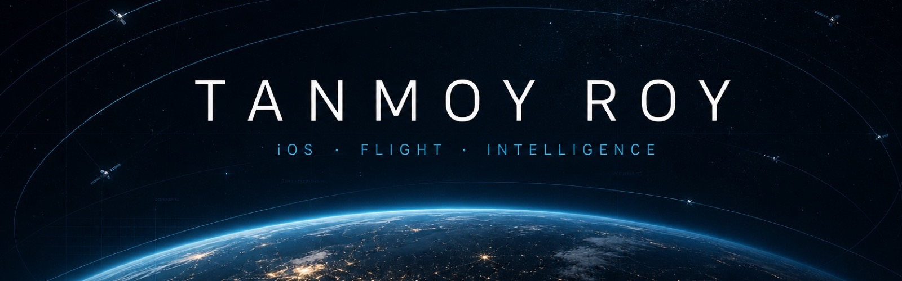
  

  <h3>
    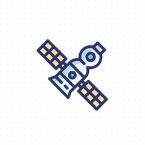
    Hi, I'm Tanmoy
    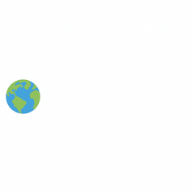
  </h3>

  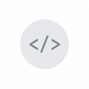

   

  

  

    
    
    
    
  

  

    
    
    
  

  

    
    
    
  

  

    
    
    
  

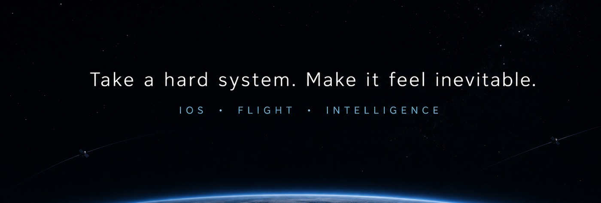

  
  
  
  
  
  
  
  
  

<b>full stack</b>

 

**Languages**
 

**Apple**
 

**Vision / ML**
 

**Robotics**
 

**Systems / agents**
 

---

## Selected work

<table>
  <tr>
    <td width="50%" valign="top">
      <a href="https://imaginative-stardust-36f7d1.netlify.app/">
        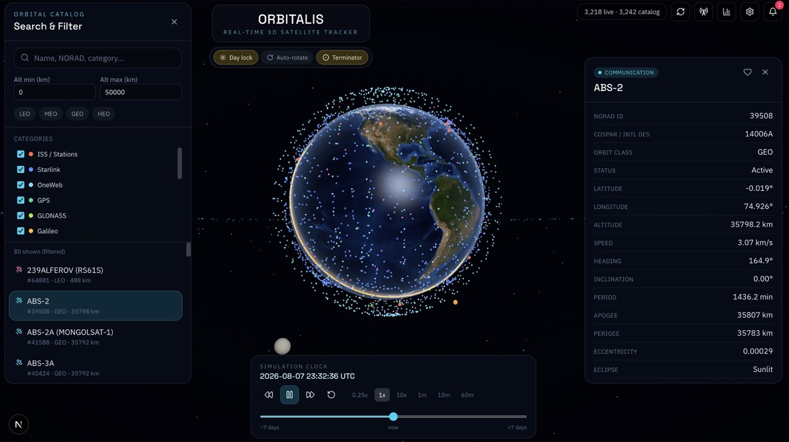
      </a>
        
      <b>ORBITALIS</b> · Three.js · live satellite catalog 
      3,200+ objects on a 3D globe — LEO/MEO/GEO filters, NORAD search, time scrub.
    </td>
    <td width="50%" valign="top">
      <a href="https://imaginative-stardust-36f7d1.netlify.app/">
        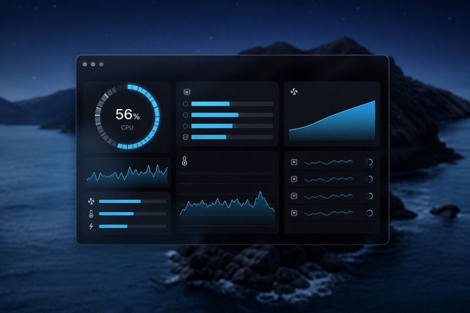
      </a>
        
      <b>MacPulse</b> · Swift · on-device telemetry 
      CPU, GPU, thermals, processes, ports — nothing leaves the Mac.
    </td>
  </tr>
</table>

  <a href="https://doi.org/10.1109/scm66446.2025.11060238">
    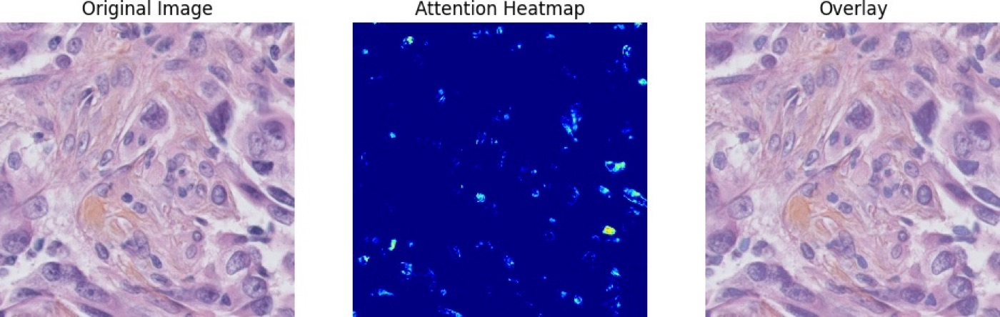
  </a>

  <b>SAAMU-Net</b> · PyTorch · IEEE Xplore 2025 
  TNBC microscopy: original · attention heatmap · overlay · <a href="https://doi.org/10.1109/scm66446.2025.11060238">Paper</a> · <a href="https://github.com/Tanmoy07072001/SAAMU-Net-U-Net-Model-for-Microscopic-Medical-Image-Segmentation">Code</a>

  <a href="https://imaginative-stardust-36f7d1.netlify.app/">
    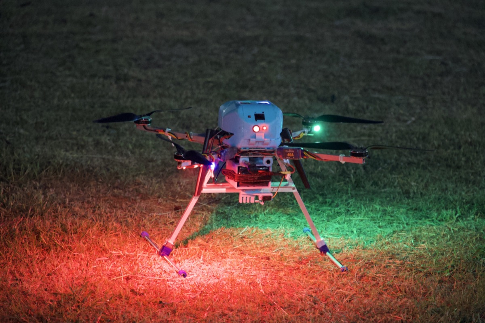
    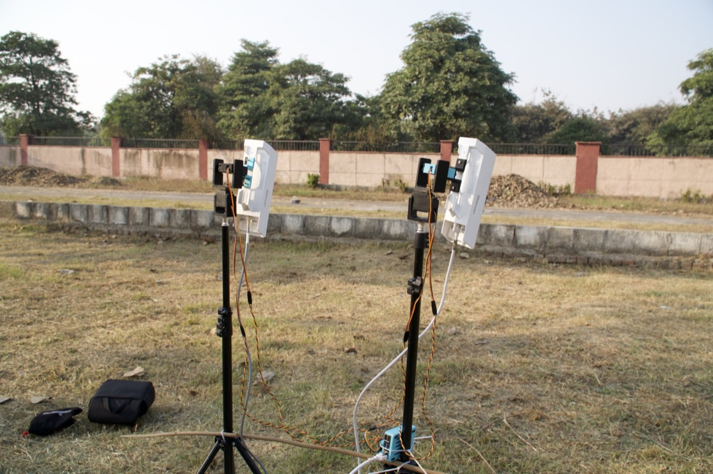
    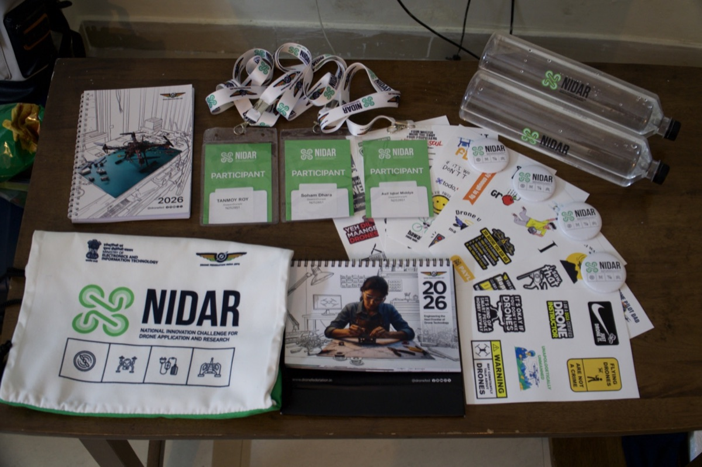
  </a>

  <b>Drone Works</b> · Pixhawk · YOLO · NIDAR 2026 · AIR 17 
  Custom airframes I assembled, missions I fly, and a YOLO pipeline for live and post-flight detection.

---

## Also on GitHub

| Project | What it does |
| --- | --- |
| [`SAAMU-Net`](https://github.com/Tanmoy07072001/SAAMU-Net-U-Net-Model-for-Microscopic-Medical-Image-Segmentation) | IEEE Xplore 2025 — medical microscopic segmentation |
| [`LinkLoop`](https://github.com/Tanmoy07072001/Twitter) | Twitter-class iOS social app on Firebase |
| [`Whisper`](https://github.com/Tanmoy07072001/chatapp2-name-whisper-) | Animated iOS chat with Firebase auth + Firestore |
| [`HotelNest`](https://github.com/Tanmoy07072001/hotelApp) | SwiftUI hotel discovery, rooms, location, flights |
| [`YoloWebApp`](https://github.com/Tanmoy07072001/yolowebapp) | Realtime YOLOv8 on image, video, and webcam |
| [`Amazon ML Challenge`](https://github.com/Tanmoy07072001/Amazon-ML-Hackathon) | Challenge entry — **rank 172** |

**Let’s build the next system.**

 

  

powered by flight logs, notebooks, and too many live globes

